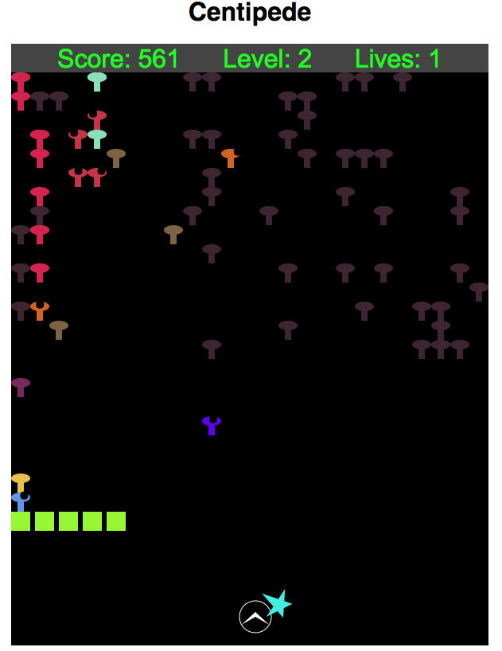

# Centipede

### [Live](https://erezbosch.github.io/centipede)
A browser version of the arcade game. Made with JavaScript and HTML5 Canvas.

### Features

* Use the mouse to move and shoot.
* Or use the arrow keys and space bar if you are a masochist.
* There's a centipede.
* You can shoot at it.
* Once you destroy all the centipede segments, a new centipede will appear.
* There are mushrooms. You can shoot them too.
* When a centipede segment is shot, it spawns a mushroom in its place.
* Sometimes when you destroy a mushroom, it'll spawn a powerup.
* If you pick up a green powerup, it'll increase your firing rate, shot speed or
number of shots.
* If you pick up a red one, it'll decrease one of those things.
* Sometimes a star looking thing will come out of the wall and chase you.
* Sometimes a different star looking thing will drop from the ceiling and add
mushrooms as it goes.
* If you run into something that's not a mushroom, you'll lose a life.
* Once you're out of lives, you lose, and you can click or press space to play
again.
* Procedurally generated sound effects.

### Implementation Details

* The game is made in Canvas.
* The game objects each have their own class &mdash; all of these classes
inherit from the MovingObject class.
* The MovingObject class contains default collision detection, drawing and
moving methods, as well as optional behaviors exhibited by multiple object types
like gravitating and bouncing off of walls
* The script to run the game consists of instantiating a GameView object.
* The GameView object creates event listeners for key and mouse events,
instantiates a Game object, and sets up an interval at which to run the game (
one step occurs every 20 ms)
* Star-shaped objects have `direction`s and turn/are drawn using trigonometry.
* A variety of collision checks are undertaken to determine when and how
centipede segments should turn.
* The ship's `weapon` is a separate object which has attributes like `rate`,
`speed` and `number` of bullets, which are altered when the ship collides with
powerups.
* The initial mushroom field, powerup spawns, and motion and appearance time of
falling stars are randomly generated in order to prevent repetition.
